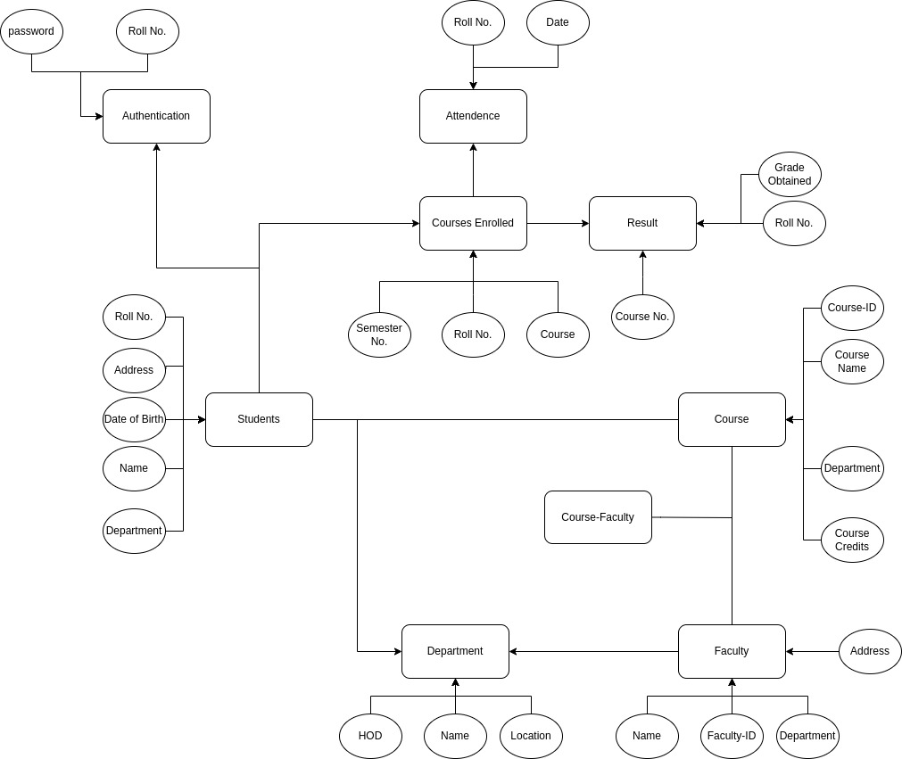

# College ERP System

This is a college ERP (Enterprise Resource Planning) system built using the Django web framework. The purpose of this project is to provide an integrated platform for managing various academic and administrative processes in a college.

## Features

- Authentication
- Student management: The system provides functionalities to manage student records including personal details, academic records, attendance, and fees.
- Faculty management: The system allows for the management of faculty records including personal details, employment details, and course management.

Test Deployment Link: https://erp.rajivharlalka.tech  (may require VPN on IIT KGP internet)

ER Diagram: 


The tech stack used in this project includes:

- Python 3.x: The programming language used to build the project.
- Django 3.x: The web framework used to build the project.
- SQLite: The database used for development and testing.
- PostgreSQL: The database used for production deployment.

## Setup

To set up the project locally, follow these steps:
```bash
Clone the repository: git clone https://github.com/rajivharlalka/dbms-project.git
Change directory to the project root: cd college-erp
Create a virtual environment: python -m venv venv
```
```bash
Activate the virtual environment:
On Windows: venv\Scripts\activate.bat
On Linux/Mac: source venv/bin/activate
```
```bash
Install the project dependencies: pip install -r requirements.txt
Create the database tables: python manage.py migrate
Create a superuser account: python manage.py createsuperuser
Start the development server: python manage.py runserver
```
## Contributing

If you'd like to contribute to the project, please follow these steps:

- Fork the project repository
- Clone your forked repository: git clone https://github.com/rajivharlalka/dbms-project.git
- Create a new branch for your changes: git checkout -b feature/your-feature-name
- Make the necessary changes to the codebase
- Push your changes to your forked repository: git push origin feature/your-feature-name
- Create a pull request to the main repository
